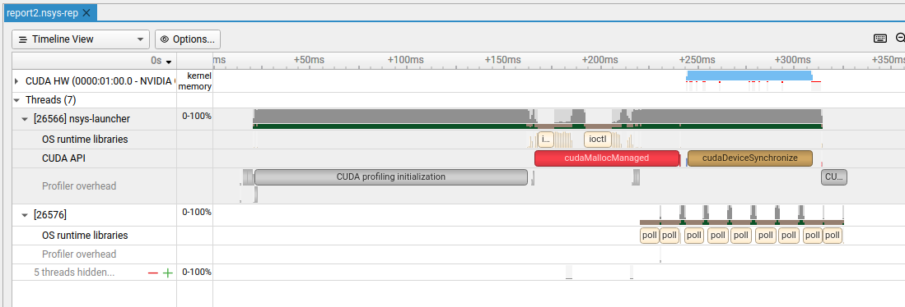
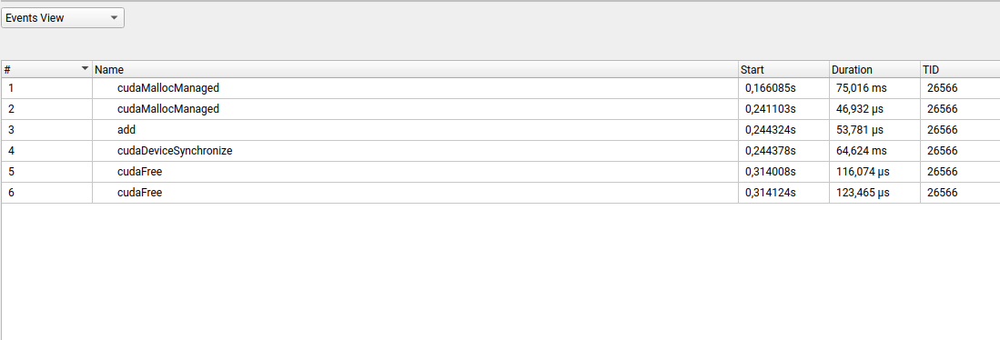

### CUDA related stuff

0. Prerequisites
  - CUDA [Toolkit](https://developer.nvidia.com/cuda-downloads) installation is required!
  - in April 2024 the 12.4 version was suggested by Nvidia:  
```bash
wget https://developer.download.nvidia.com/compute/cuda/repos/ubuntu2204/x86_64/cuda-ubuntu2204.pin
sudo mv cuda-ubuntu2204.pin /etc/apt/preferences.d/cuda-repository-pin-600
wget https://developer.download.nvidia.com/compute/cuda/12.4.0/local_installers/cuda-repo-ubuntu2204-12-4-local_12.4.0-550.54.14-1_amd64.deb
sudo dpkg -i cuda-repo-ubuntu2204-12-4-local_12.4.0-550.54.14-1_amd64.deb
sudo cp /var/cuda-repo-ubuntu2204-12-4-local/cuda-*-keyring.gpg /usr/share/keyrings/sudo apt-get update
sudo apt-get -y install cuda-toolkit-12-4 
```

1. Links
  - CUDA [cheat sheet](https://kdm.icm.edu.pl/Tutorials/GPU-intro/introduction.en/) from ICM UW :muscle:,
  - [Educator Programs](https://www.nvidia.com/en-us/training/educator-programs/) from NVIDIA,
  - [Deep Learning Institite](https://www.nvidia.com/en-us/training/) of NVIDIA,
  - An Even Easier [Introduction to CUDA](https://developer.nvidia.com/blog/even-easier-introduction-cuda/),
  - [Unified Memory](https://developer.nvidia.com/blog/unified-memory-cuda-beginners/) for CUDA Beginners,
  - CUDA [Pro Tip](https://developer.nvidia.com/blog/cuda-pro-tip-write-flexible-kernels-grid-stride-loops/): Write Flexible Kernels with Grid-Stride Loops,
  - CUDA [refresher](https://developer.nvidia.com/blog/cuda-refresher-cuda-programming-model/)
  - [PyCUDA](https://documen.tician.de/pycuda/index.html) documentation,

2. Comparison of times execution with different configurations of CUDA blocks and threads for `Titan XP` GPU.  
  - with one thread (file `add_with_one_thread.cu`):  

After running `nvprof ./name_of_the_executable` we can get profiling information:  

```bash
==28297== Profiling application: ./add_with_one_thread.out
==28297== Profiling result:
            Type  Time(%)      Time     Calls       Avg       Min       Max  Name
 GPU activities:  100.00%  180.57ms         1  180.57ms  180.57ms  180.57ms  add(int, float*, float*)
      API calls:   55.81%  229.34ms         2  114.67ms  26.060us  229.32ms  cudaMallocManaged
                   43.94%  180.57ms         1  180.57ms  180.57ms  180.57ms  cudaDeviceSynchronize
                    0.12%  509.33us         2  254.67us  212.52us  296.81us  cudaFree
                    0.09%  386.69us       101  3.8280us     350ns  150.37us  cuDeviceGetAttribute
                    0.01%  58.070us         1  58.070us  58.070us  58.070us  cudaLaunchKernel
                    0.01%  24.500us         1  24.500us  24.500us  24.500us  cuDeviceGetName
                    0.00%  9.0700us         1  9.0700us  9.0700us  9.0700us  cuDeviceGetPCIBusId
                    0.00%  8.3000us         1  8.3000us  8.3000us  8.3000us  cuDeviceTotalMem
                    0.00%  3.9600us         3  1.3200us     790ns  2.2400us  cuDeviceGetCount
                    0.00%  2.0400us         2  1.0200us     400ns  1.6400us  cuDeviceGet
                    0.00%     640ns         1     640ns     640ns     640ns  cuDeviceGetUuid

==28297== Unified Memory profiling result:
Device "NVIDIA TITAN Xp (0)"
   Count  Avg Size  Min Size  Max Size  Total Size  Total Time  Name
      48  170.67KB  4.0000KB  0.9961MB  8.000000MB  674.3690us  Host To Device
      24  170.67KB  4.0000KB  0.9961MB  4.000000MB  324.0470us  Device To Host
      12         -         -         -           -  3.497374ms  Gpu page fault groups
Total CPU Page faults: 36
```

  - with one block (file `add_with_one_block.cu`):  
```bash
==28360== Profiling application: ./add_with_one_block.out
==28360== Profiling result:
            Type  Time(%)      Time     Calls       Avg       Min       Max  Name
 GPU activities:  100.00%  2.3604ms         1  2.3604ms  2.3604ms  2.3604ms  add(int, float*, float*)
      API calls:   98.10%  172.40ms         2  86.200ms  25.680us  172.37ms  cudaMallocManaged
                    1.34%  2.3617ms         1  2.3617ms  2.3617ms  2.3617ms  cudaDeviceSynchronize
                    0.28%  495.37us         2  247.69us  193.43us  301.94us  cudaFree
                    0.22%  381.13us       101  3.7730us     400ns  151.68us  cuDeviceGetAttribute
                    0.03%  52.740us         1  52.740us  52.740us  52.740us  cudaLaunchKernel
                    0.01%  26.000us         1  26.000us  26.000us  26.000us  cuDeviceGetName
                    0.01%  14.420us         1  14.420us  14.420us  14.420us  cuDeviceTotalMem
                    0.00%  8.6100us         1  8.6100us  8.6100us  8.6100us  cuDeviceGetPCIBusId
                    0.00%  3.8100us         3  1.2700us     570ns  2.3700us  cuDeviceGetCount
                    0.00%  1.9800us         2     990ns     430ns  1.5500us  cuDeviceGet
                    0.00%     740ns         1     740ns     740ns     740ns  cuDeviceGetUuid

==28360== Unified Memory profiling result:
Device "NVIDIA TITAN Xp (0)"
   Count  Avg Size  Min Size  Max Size  Total Size  Total Time  Name
      48  170.67KB  4.0000KB  0.9961MB  8.000000MB  745.6360us  Host To Device
      24  170.67KB  4.0000KB  0.9961MB  4.000000MB  324.5900us  Device To Host
      12         -         -         -           -  1.605040ms  Gpu page fault groups
Total CPU Page faults: 36
```

  - with grid (file `add_with_grid.cu`):  
```bash
 ==28475== Profiling application: ./add_with_grid.out
==28475== Profiling result:
            Type  Time(%)      Time     Calls       Avg       Min       Max  Name
 GPU activities:  100.00%  2.8978ms         1  2.8978ms  2.8978ms  2.8978ms  add(int, float*, float*)
      API calls:   97.68%  163.64ms         2  81.818ms  24.260us  163.61ms  cudaMallocManaged
                    1.73%  2.8993ms         1  2.8993ms  2.8993ms  2.8993ms  cudaDeviceSynchronize
                    0.30%  494.36us         2  247.18us  195.50us  298.86us  cudaFree
                    0.23%  379.41us       101  3.7560us     360ns  155.04us  cuDeviceGetAttribute
                    0.03%  51.221us         1  51.221us  51.221us  51.221us  cudaLaunchKernel
                    0.02%  33.171us         1  33.171us  33.171us  33.171us  cuDeviceGetName
                    0.01%  14.720us         1  14.720us  14.720us  14.720us  cuDeviceGetPCIBusId
                    0.01%  13.320us         1  13.320us  13.320us  13.320us  cuDeviceTotalMem
                    0.00%  3.7000us         3  1.2330us     510ns  2.2900us  cuDeviceGetCount
                    0.00%  1.6800us         2     840ns     370ns  1.3100us  cuDeviceGet
                    0.00%     700ns         1     700ns     700ns     700ns  cuDeviceGetUuid

==28475== Unified Memory profiling result:
Device "NVIDIA TITAN Xp (0)"
   Count  Avg Size  Min Size  Max Size  Total Size  Total Time  Name
     107  76.561KB  4.0000KB  996.00KB  8.000000MB  789.5830us  Host To Device
      24  170.67KB  4.0000KB  0.9961MB  4.000000MB  324.3370us  Device To Host
      15         -         -         -           -  3.036642ms  Gpu page fault groups
Total CPU Page faults: 36
```

  - with grid for Pascal architecture (file `add_with_grid_for_Pascal.cu`):  
> we have two kernels inside!
```bash
 ==28523== Profiling application: ./add_with_grid_for_Pascal.out
==28523== Profiling result:
            Type  Time(%)      Time     Calls       Avg       Min       Max  Name
 GPU activities:   99.25%  4.2581ms         1  4.2581ms  4.2581ms  4.2581ms  init(int, float*, float*)
                    0.75%  32.258us         1  32.258us  32.258us  32.258us  add(int, float*, float*)
      API calls:   96.90%  164.59ms         2  82.294ms  71.451us  164.52ms  cudaMallocManaged
                    2.55%  4.3303ms         1  4.3303ms  4.3303ms  4.3303ms  cudaDeviceSynchronize
                    0.28%  477.67us         2  238.84us  164.38us  313.29us  cudaFree
                    0.21%  358.99us       101  3.5540us     350ns  147.30us  cuDeviceGetAttribute
                    0.03%  48.420us         2  24.210us  6.4900us  41.930us  cudaLaunchKernel
                    0.01%  21.990us         1  21.990us  21.990us  21.990us  cuDeviceGetName
                    0.01%  16.550us         1  16.550us  16.550us  16.550us  cuDeviceGetPCIBusId
                    0.01%  13.690us         1  13.690us  13.690us  13.690us  cuDeviceTotalMem
                    0.00%  3.4800us         3  1.1600us     610ns  1.8200us  cuDeviceGetCount
                    0.00%  1.8500us         2     925ns     400ns  1.4500us  cuDeviceGet
                    0.00%     760ns         1     760ns     760ns     760ns  cuDeviceGetUuid

==28523== Unified Memory profiling result:
Device "NVIDIA TITAN Xp (0)"
   Count  Avg Size  Min Size  Max Size  Total Size  Total Time  Name
      24  170.67KB  4.0000KB  0.9961MB  4.000000MB  325.1050us  Device To Host
      14         -         -         -           -  3.901906ms  Gpu page fault groups
Total CPU Page faults: 12
```

3. Comparison of times execution with different configurations of CUDA blocks and threads for `RTX4060` GPU (laptop).  
When trying to run `nvprof ./add_with_one_thread.out`, it started with warning:  
```bash
======== Warning: nvprof is not supported on devices with compute capability 8.0 and higher.
                  Use NVIDIA Nsight Systems for GPU tracing and CPU sampling and NVIDIA Nsight Compute for GPU profiling.
                  Refer https://developer.nvidia.com/tools-overview for more details.

```
After `ncu-ui` the problem appeared:  
```bash
Cannot mix incompatible Qt library (5.15.3) with this library (5.15.2)
```
Solution was found [here](https://stackoverflow.com/questions/75792998/incompatible-qt-libraries-and-the-cuda-toolkit).
After installation of NVIDIA Nsight Systems we can run the command `nsys profile name_of_the_executable` and then the profiling report is generated to the file `report1.nsys-rep`.
To see this report we have to run `nsys-ui report1.nsys.rep`:  
  

After clicking right mouse button on `CUDA API` and choosing "Show the Events View" we can get timing information:  
 
