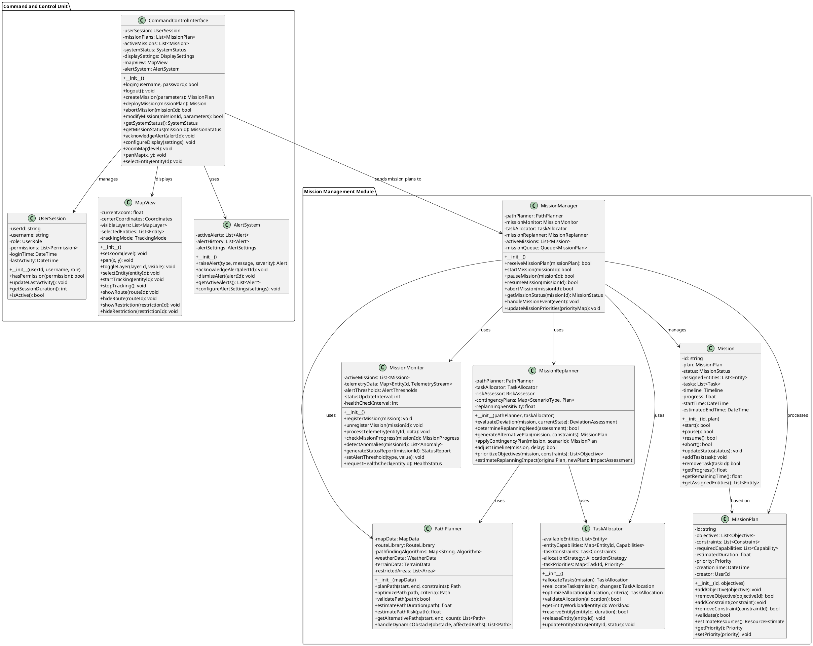
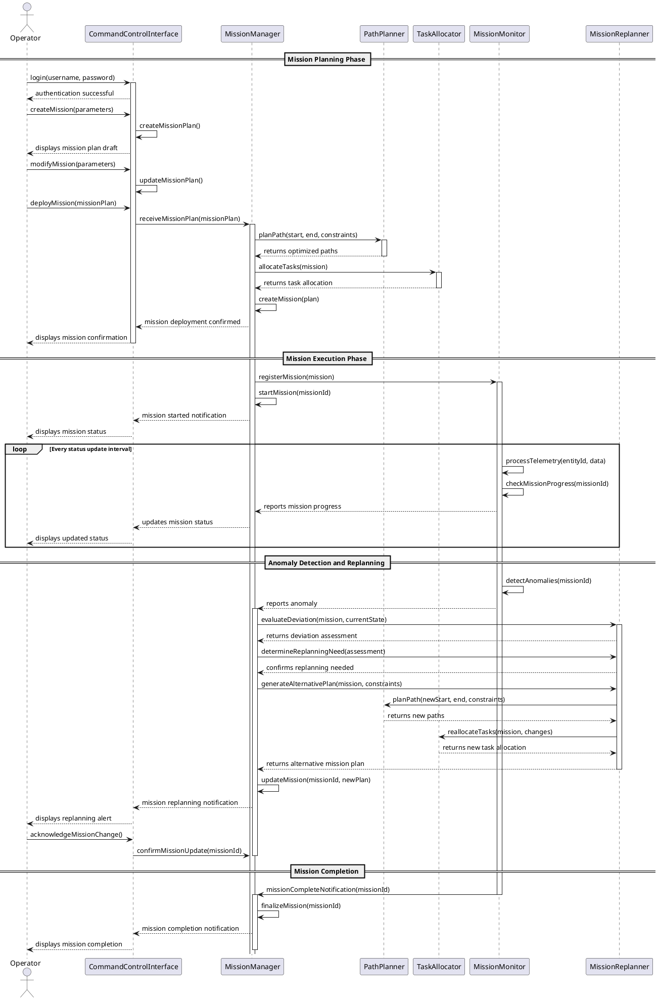
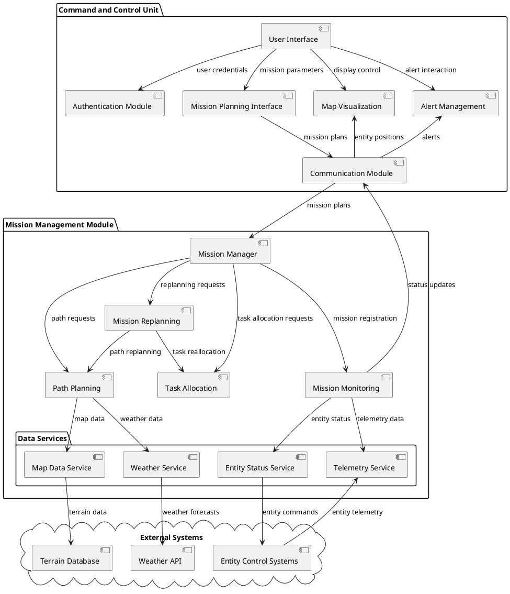

# Human Machine Interface (HMI) Architecture: Command and Control with Mission Management

This document provides a formal description of the Human Machine Interface architecture for a system with a Command and Control unit interfacing with a Mission Management module, using UML diagrams.

## 1. Class Diagram

## 2. Sequence Diagram

## 3. Component Diagram

## 4. HMI Architecture Description

The Human Machine Interface architecture for the Command and Control (C2) and Mission Management (MM) system consists of two main components that interact to plan, execute, monitor, and adapt missions.

### Command and Control Unit

The Command and Control Unit provides the interface between human operators and the mission management systems. It is responsible for:

1. **User Authentication and Session Management**:
   - Verifying operator credentials and establishing user sessions
   - Managing user permissions and access control
   - Tracking user activity and session duration

2. **Mission Planning and Deployment**:
   - Creating mission plans with objectives, constraints, and parameters
   - Modifying mission plans based on operator input
   - Deploying finalized mission plans to the Mission Management Module

3. **Situational Awareness**:
   - Displaying map visualization with mission-relevant information
   - Managing map layers, zoom levels, and entity tracking
   - Showing mission progress, entity positions, and planned routes

4. **Alert Management**:
   - Displaying alerts from mission monitoring systems
   - Allowing operators to acknowledge and respond to alerts
   - Configuring alert thresholds and notification settings

5. **Mission Control**:
   - Providing controls to start, pause, resume, or abort missions
   - Allowing operators to approve or modify replanning suggestions
   - Displaying mission status and progress information

### Mission Management Module

The Mission Management Module handles the technical aspects of mission execution and consists of four main components:

1. **Path Planning**:
   - Generating optimal paths based on mission objectives and constraints
   - Considering terrain, weather, and restricted areas in path calculations
   - Providing alternative paths when needed
   - Estimating path duration, resource usage, and risk factors

2. **Mission Monitoring**:
   - Tracking mission progress against the planned timeline
   - Processing telemetry data from mission entities
   - Detecting anomalies and deviations from the mission plan
   - Generating status reports and health checks

3. **Task Allocation**:
   - Assigning tasks to entities based on capabilities and availability
   - Optimizing task distribution for efficiency and mission success
   - Tracking entity workload and task completion
   - Reallocating tasks when entity status changes

4. **Mission Replanning**:
   - Evaluating the need for replanning based on mission deviations
   - Generating alternative plans when necessary
   - Applying contingency plans for predefined scenarios
   - Estimating the impact of replanning on mission objectives

### Key Interactions and Actions

1. **Mission Creation and Deployment**:
   - Operator creates a mission plan through the C2 interface
   - C2 sends the mission plan to the Mission Manager
   - Path Planner generates optimal routes
   - Task Allocator assigns entities to tasks
   - Mission Manager creates and registers the mission
   - C2 displays confirmation to the operator

2. **Mission Execution and Monitoring**:
   - Mission Monitor tracks entity telemetry and mission progress
   - C2 displays real-time mission status to the operator
   - Alert System notifies operators of significant events
   - Map View shows entity positions and mission progress

3. **Anomaly Handling and Replanning**:
   - Mission Monitor detects anomalies or deviations
   - Mission Replanner evaluates the situation and determines if replanning is needed
   - If necessary, new paths are generated and tasks are reallocated
   - C2 notifies the operator of the proposed changes
   - Operator approves or modifies the replanning suggestion
   - Mission Manager updates the mission with the new plan

4. **Mission Completion**:
   - Mission Monitor detects mission completion
   - Mission Manager finalizes the mission
   - C2 notifies the operator of mission completion
   - Mission data is archived for future reference

This architecture provides a comprehensive framework for human operators to plan, monitor, and control complex missions while leveraging automated systems for path planning, task allocation, monitoring, and adaptive replanning.