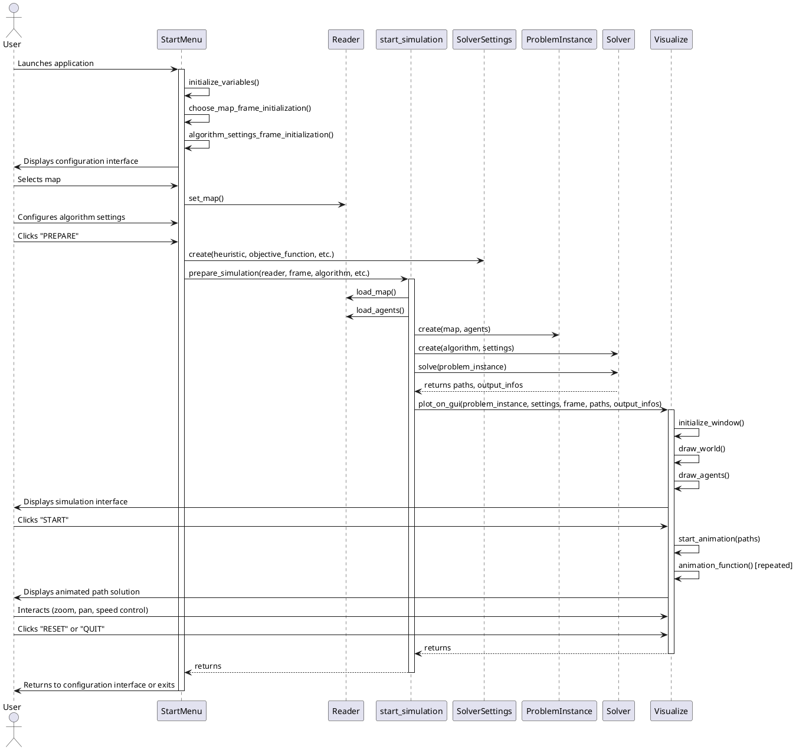
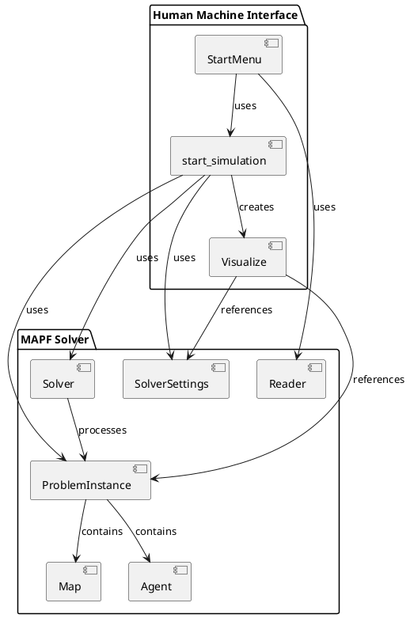

# Human Machine Interface (HMI) Description using UML

This document provides a formal description of the Human Machine Interface for the Multi-Agent Path Finding (MAPF) system using UML diagrams.

## 1. Class Diagram

```plantuml
@startuml
skinparam classAttributeIconSize 0

package "Human Machine Interface" {
  class StartMenu {
    - root: Tk
    - frame: Frame
    - settings_frame: Frame
    - simulation_frame: Frame
    - choose_map_frame: Frame
    - algorithm_settings_frame: Frame
    - map_images_list: List
    - random_images_list: List
    - buttons_list: List
    - reader: Reader
    - waiting_var: StringVar
    - selected_algorithm_var: StringVar
    - independence_detection_var: BooleanVar
    - selected_map_var: IntVar
    - selected_heuristic_var: StringVar
    - selected_objective_function_var: StringVar
    - selected_goal_occupation_time: IntVar
    - selected_n_of_agents: IntVar
    - selected_scene_type: StringVar
    - selected_scene_number: IntVar
    - edge_conflicts_var: BooleanVar
    - stay_at_goal_var: BooleanVar
    - time_out_var: IntVar
    + __init__()
    + callback(event)
    + initialize_variables()
    + choose_map_frame_initialization()
    + set_reader_map()
    + on_configure(event)
    + algorithm_settings_frame_initialization()
    + initialize_permanence_in_goal_canvas(canvas)
    + stay_at_goal_button_function()
    + initialize_scene_selection_canvas(canvas)
    + initialize_n_of_agents_canvas(canvas)
    + initialize_time_out_canvas(canvas)
    + prepare_simulation_function()
    + change_scene_instances()
    + goal_occupation_time_down_button_function()
    + goal_occupation_time_up_button_function()
    + change_scene_button()
    + scene_file_number_down_button()
    + scene_file_number_up_button()
    + n_of_agents_down_button()
    + n_of_agents_up_button()
    + enable_settings_buttons()
    + disable_settings_buttons()
    + load_image(url, size)
    + do_loop()
  }

  class Visualize {
    - _problem_instance: ProblemInstance
    - _solver_settings: SolverSettings
    - _frame: Frame
    - _paths: List
    - _output_infos: Dict
    - random_images_list: List
    - _goals_list: List
    - animation_speed: float
    - _frame_width: int
    - _frame_height: int
    - visualize_frame: Frame
    - visualize_canvas: Canvas
    - map_canvas: Canvas
    - infos_and_buttons_canvas: Canvas
    - infos_txt_var: StringVar
    - quit_button: Button
    - start_button: Button
    - reset_button: Button
    - speed_txt_var: StringVar
    - time_step_counter: int
    - time_step_txt_var: StringVar
    - cell_h: float
    - cell_w: float
    - dynamic_cell_h: float
    - dynamic_cell_w: float
    - vis_cells: numpy.ndarray
    - agents_ovals: List
    - agents_colors: List
    - text_list: List
    - animating: bool
    - _footsteps: bool
    - path_to_visit: List
    - steps_count: List
    - x_moves: List
    - y_moves: List
    + __init__(problem_instance, solver_settings, frame, paths, output_infos)
    + initialize_window()
    + set_up_scrollbar()
    + move_start(event)
    + move_move(event)
    + linux_zoom_p(event)
    + linux_zoom_m(event)
    + windows_zoom(event)
    + start_function()
    + reset_function()
    + quit_function()
    + initialize_speed_regulation_widgets()
    + speed_down_function()
    + speed_up_function()
    + set_infos_txt()
    + draw_world()
    + draw_agents()
    + draw_paths(paths)
    + start_animation(paths)
    + animation_function()
    + draw_footsteps()
    + get_cell_size()
    + load_image(url, size)
    + do_loop()
  }

  class "start_simulation" << (M,orchid) module >> {
    + prepare_simulation(reader, frame, algorithm_str, independence_detection, solver_settings, n_of_agents)
    + plot_paths(problem_instance, solver_settings, paths)
    + plot_on_gui(problem_instance, solver_settings, frame, paths, output_infos)
  }

  class SolverSettings {
    - heuristic: string
    - objective_function: string
    - stay_at_goal_flag: bool
    - goal_occupation_time: int
    - edge_conflict_flag: bool
    - time_out: int
    + __init__(heuristic, objective_function, stay_at_goal, goal_occupation_time, edge_conflict, time_out)
    + get_heuristic()
    + get_objective_function()
    + stay_at_goal()
    + get_goal_occupation_time()
    + edge_conflict()
    + get_time_out()
  }

  class Reader {
    - map_number: int
    - scenario_type: string
    - scenario_file_number: int
    - scenario_instances: List
    + __init__()
    + set_map(map_number)
    + set_scenario_type(scenario_type)
    + set_scenario_file_number(scenario_file_number)
    + change_scenario_instances()
    + get_map_file()
    + get_scenario_file()
  }

  class ProblemInstance {
    - map: Map
    - agents: List<Agent>
    + __init__(map, agents)
    + get_map()
    + get_agents()
    + plot_on_gui(frame, paths)
  }

  StartMenu --> Reader : uses
  StartMenu --> "start_simulation" : calls prepare_simulation()
  "start_simulation" --> Visualize : creates
  "start_simulation" --> SolverSettings : uses
  "start_simulation" --> ProblemInstance : uses
  Visualize --> ProblemInstance : references
  Visualize --> SolverSettings : references
}

@enduml
```

## 2. Sequence Diagram

## 3. Component Diagram

## 4. HMI Description

The Human Machine Interface (HMI) for the Multi-Agent Path Finding system consists of three main components:

1. **StartMenu**: The main entry point for user interaction. It provides a graphical interface for:
   - Selecting maps from a visual gallery
   - Choosing algorithms and their parameters
   - Setting simulation parameters (number of agents, goal occupation time, etc.)
   - Launching the simulation

2. **start_simulation module**: Acts as a bridge between the UI and the simulation visualization:
   - Prepares the simulation by loading maps and agents
   - Initializes and runs the path finding solver
   - Passes the results to the visualization component

3. **Visualize**: Handles the rendering and animation of the path finding solution:
   - Draws the map grid and agents
   - Animates agent movements along their computed paths
   - Provides interactive controls (start, reset, quit)
   - Offers zoom, pan, and speed control functionality
   - Displays solution metrics (sum of costs, makespan, etc.)

The HMI follows a clear separation of concerns:
- User input and configuration management (StartMenu)
- Business logic coordination (start_simulation)
- Visualization and animation (Visualize)

This design allows for a user-friendly experience while maintaining a clean architecture that separates the UI from the underlying path finding algorithms.